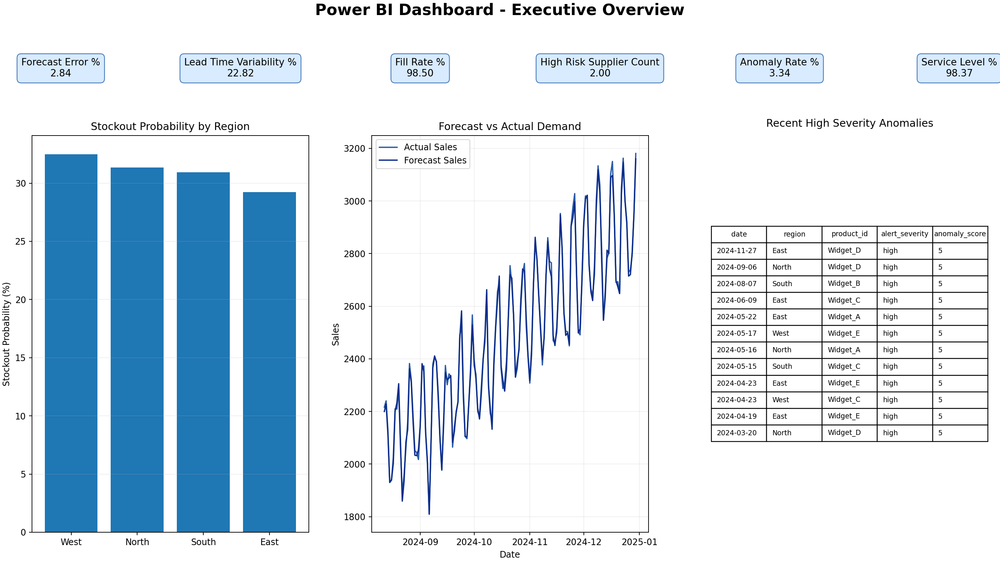
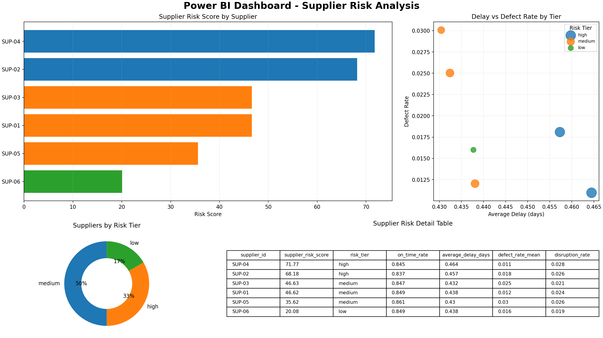
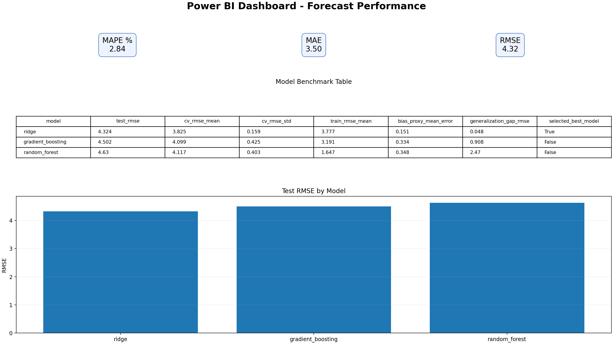

# GenAI Powered Supply Chain Intelligence and Risk Optimization Platform

## Purpose

This project is an end-to-end decision support system for supply chain teams. It combines machine learning, anomaly analytics, supplier risk scoring, and natural language explanations so that planning, operations, and procurement teams can make faster and better decisions.

## Features

- Demand forecasting with lag, rolling, and seasonality features
- Model benchmarking across Random Forest, Gradient Boosting, and Ridge Regression
- Supply chain anomaly detection for sales drops, delivery delays, and cost spikes
- Supplier risk scoring with tiering (low, medium, high, critical)
- Dashboard-ready KPI and analytics tables for Power BI and Tableau
- Retrieval-augmented copilot for natural language explanation of KPIs and risks

## Tech Stack

- Python
- Pandas, NumPy, SciPy
- scikit-learn
- OpenAI API (optional for LLM responses)
- Power BI / Tableau

## How the Project Works

1. Historical supply chain data is loaded and validated.
2. Forecasting features are built using lag, rolling, and seasonality encodings.
3. Multiple forecasting models are trained and evaluated.
4. Operations data is scanned for anomalies with Isolation Forest, DBSCAN, and Z-score logic.
5. Supplier risk scores are computed from delivery, quality, and disruption behavior.
6. KPI output tables are generated for executive dashboards.
7. A RAG copilot retrieves relevant context and generates business explanations.

## Architecture

```text
Data Ingestion and Validation
        |
        v
Feature Engineering
        |
        +--------------------+
        |                    |
        v                    v
Demand Forecasting      Anomaly Detection
        |                    |
        +---------+----------+
                  |
                  v
           Supplier Risk Scoring
                  |
                  v
          KPI and Dashboard Exports
                  |
                  v
      RAG Copilot (Embeddings + LLM)
```

## Power BI Dashboard Screenshots

### Executive Overview



### Supplier Risk Analysis



### Forecast Performance



## Outputs

Typical generated outputs include:

- `outputs/historical_supply_chain_data.csv`
- `outputs/dashboard/demand_forecast_vs_actual.csv`
- `outputs/dashboard/stockout_probability.csv`
- `outputs/dashboard/supplier_risk_scores.csv`
- `outputs/dashboard/anomaly_alerts.csv`
- `outputs/dashboard/forecast_accuracy_metrics.csv`
- `outputs/dashboard/kpi_summary.csv`
- `outputs/models/best_demand_model.joblib`
- `outputs/models/forecast_model_benchmark.csv`

## Results and Metrics

Sample run metrics from this project:

- Service Level: 98.37%
- Fill Rate: 98.50%
- Lead Time Variability: 22.82%
- Forecast Error (MAPE): 2.84%
- Anomaly Rate: 3.34%
- High Risk Supplier Count: 2
- MAE: 3.50
- RMSE: 4.32

These values can change based on input data and run configuration.

## Future Scope

- Use dense embeddings and a vector database for larger document retrieval
- Add confidence intervals and probabilistic forecasting
- Add streaming anomaly detection for near real-time monitoring
- Add optimization modules for inventory and replenishment decisions
- Add model drift detection and automated retraining workflows
- Add role-based access and enterprise deployment controls

## How to Access and Run the Project

The implementation code is maintained in branch:

- `feature/e2e-pipeline-orchestration`

### Clone and open the project

```bash
git clone https://github.com/Pradsey5010/GenAI-Powered-Supply-Chain-Intelligence-Risk-Optimization-Platform.git
cd GenAI-Powered-Supply-Chain-Intelligence-Risk-Optimization-Platform
git checkout feature/e2e-pipeline-orchestration
```

### Install dependencies

```bash
python3 -m venv .venv
source .venv/bin/activate
pip install -r requirements.txt
```

### Run pipeline

```bash
python3 scripts/run_pipeline.py --output-dir outputs
```

### Publish dashboard CSV files for Power BI

```bash
bash scripts/publish_dashboard_data.sh
```

This generates and updates the dashboard CSV folder:

- `dashboard_data/`

Use these CSV files directly in Power BI Desktop or via GitHub raw links.